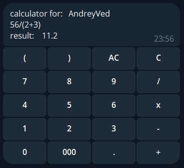

# Сalculator-bot

Simple telegram bot



## Used technology
* Python 3.10;
* aiogram 3.x (Telegram Bot framework);
* Docker and Docker Compose (containerization);

## Installation and removal

Rename `env_dist` to `.env` and specify the correct bot token in it.
  
Start your bot with docker-compose command:
```bash
$ docker-compose up 
```
Stop lifted containers:
```bash
$ docker-compose stop
```
Start stopped containers:
```bash
$ docker-compose  start
```
Stop and delete containers and network:
```bash
$ docker-compose down
```
Remove app image:
```bash
$ docker rmi calculator_bot